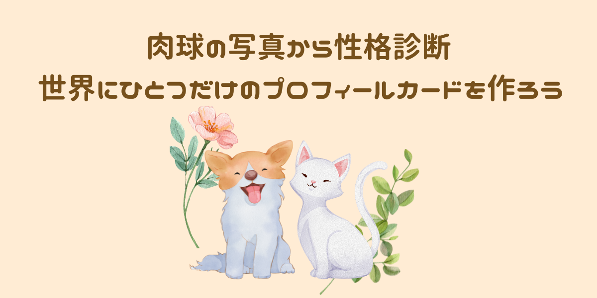

　サービスURL: https://www.nikukyu-shindan.com
## サービス概要

　犬猫を飼っている人が飼っている犬猫に、より愛着を持って飼ってもらうための犬猫の性格診断、およびプロフィールカード作成サービスです

## ターゲットユーザー

　犬猫を飼っているかわいい物好きの20〜50代の男女

　飼っている犬猫にちゃんと愛情があるしお世話もしっかりできているけど、飼い始めて数年経ち、以前ほど犬猫にかまってあげられなくなっている人 

 
ユーザーが抱える課題

　犬猫を飼い始めた当初は小さかったしすごく可愛くて愛情を持って育ててきた 
　今も可愛いと思うしお世話もしっかりできているが、飼い始めた当初よりはかまってあげられていない

 
解決方法

　①肉球の性格診断結果を通して犬猫の行動、性格により興味を持ってもらう 
　②プロフィールカードをSNSプロフィールに設定していただくことで、さらに身近に犬猫を感じてもらう 
　③シェア機能による性格診断結果やプロフィールカードの共有で、飼い主同士のコミュニケーションをしてもらう 
　これら①〜③を通して飼い主が犬猫を意識するきっかけを多くつくり、今までより愛着を持って飼ってもらう

## なぜこのサービスを作りたいのか？ 
　ペットを飼うということは一面として、ペットの意思とは関係なくペットを家族から引き離して自分の家に連れて帰り、自分の欲求を叶えているということだと思っています。 
　なので飼い始めたペットには幸せな一生を送ってもらえるように、飼い主には愛着を持って育てて欲しいと思っています。ペットに愛着を持てる機会を増やし、飼い主も楽しめるサービスを作ろうと思いました。 
　「ペットを大切に育てよう」のような直接的な言い方ではなく、性格診断の結果として、一般的に気をつけた方がいいことやペットがより幸せに過ごせるであろうアドバイスを散りばめてあります。 
　また、Twitterヘッダーやシェア機能を実装していますので、診断結果を拡散してもらい、その中で継続的に愛着を持てる機会を作って頂きたいと思っています。

## MVPリリース以降に実装予定の機能

　・検索フォームから性格タイプ別にみんなのプロフィールカードを絞り込むことができる 
　・ペットの顔写真からの背景切り取り 
　・プロフィールカードに肉球のシルエット化したもの(手形のようなもの)を載せる 
　・期間限定のプロフィールカードを用意 
　・Twitterログイン機能 
　・Google Analytics の導入 
　・利用規約、プライバシーポリシーの作成 
　・アバター機能 

## 使用技術
バックエンド 
　・Ruby 3.1.2 
　・Rails 7.0.4 
フロントエンド 
　・JavaScript 
　・TailwindCSS-daisyUI 
インフラ 
　・Heroku 
　・AmazonS3 
　・PostgreSQL 
API 
　・Microsoft CustomVision(性格診断に使用) 

## スケジュール
　企画〜技術調査：9/31〆切 
　README〜ER図作成：9/21〆切 
　メイン機能実装：10/1 - 11/27 
　β版をRUNTEQ内リリース（MVP）：11/27 
　本番リリース：12/11 

## ER図

## 画面遷移図
　https://www.figma.com/file/9YPN97bL9kRqLtivVG1gOa/toppage?node-id=0%3A1 
